# Procesverslag
**Auteur:** Nino van der Vinden

**De opdrachten:** [opdracht 1](opdracht1/index.html) en [opdracht 2](opdracht2/index.html)

Markdown is een simpele manier om HTML te schrijven.  
Markdown cheat cheet: [Hulp bij het schrijven van Markdown](https://github.com/adam-p/markdown-here/wiki/Markdown-Cheatsheet).

Nb. De standaardstructuur en de spartaanse opmaak van de README.md zijn helemaal prima. Het gaat om de inhoud van je procesverslag. Besteedt de tijd voor pracht en praal aan je website.

Nb. Door *open* toe te voegen aan een *details* element kun je deze standaard open zetten. Fijn om dat steeds voor de relevante stuk(ken) te doen.

## Bronnenlijst
  1. [Tilt-shake functie](https://unused-css.com/blog/css-shake-animation/)
  2. [Heineken Font](https://allyourfonts.com/font/heineken-font/)
  3. [Clamp uitleg](https://developer.mozilla.org/en-US/docs/Web/CSS/clamp)
  4. [Syntax](https://stackoverflow.com/questions/13233991/combine-after-with-hover)
  5. [Reduced Motion](https://developer.mozilla.org/en-US/docs/Web/CSS/@media/prefers-reduced-motion)
  6. [Clippy](https://bennettfeely.com/clippy/)
  7. [Liquid effect tutorial](https://www.youtube.com/watch?v=wGPDuqgkoew&ab_channel=Codingflag)
  8. [ChatGPT](https://chat.openai.com)
  
  ### ChatGPT code questions:
  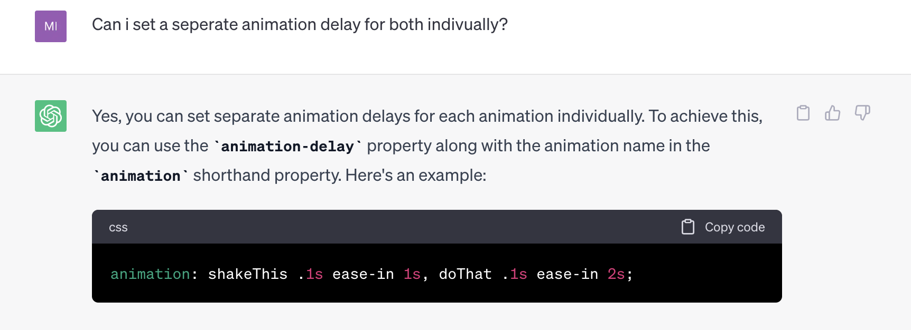

## Opdracht 1 plan

  
uitwerken na schetsen idee (voor week 2)

  ### Je storyboard:
  

  ### Je ambitie: 
  Aan deze technieken/punten wil ik werken:
  - Vormen stylen/animeren
  - Lagen over elkaar animeren (parallax)
  - "Realistische physics" / liquid effect
 

## Opdracht 1 reflectie

  
uitwerken bij afronden opdracht (voor week 4)

  
  ### Peer Feedback
   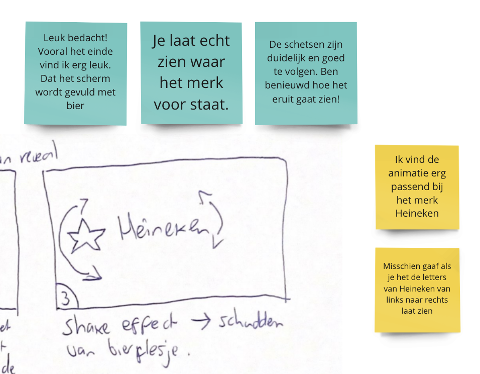

  ### Je uitkomst - karakteristiek screenshot(s):
  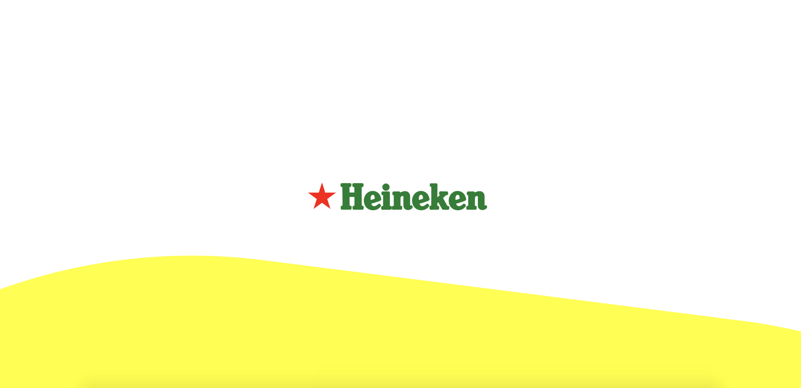
  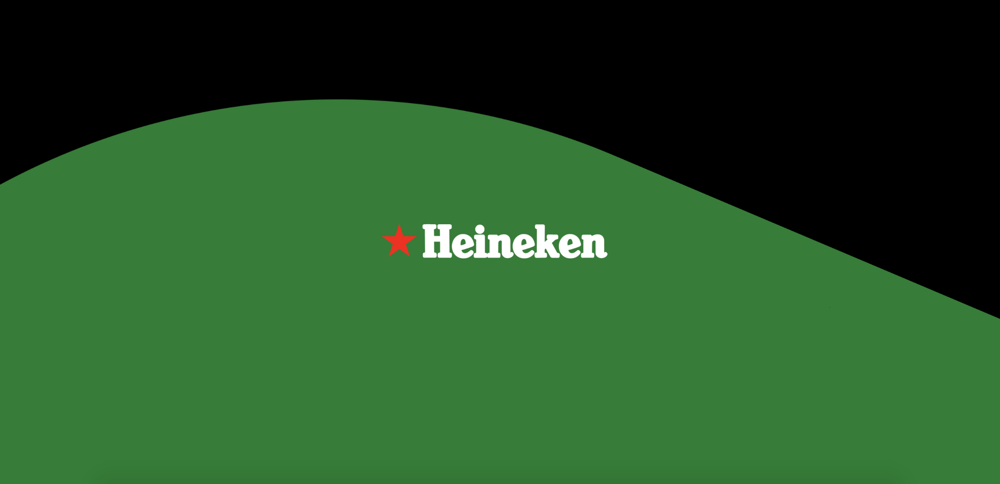

  ### Dit ging goed/Heb ik geleerd: 
 Mijn focus lag nooit echt op animeren gedurende mijn front-end loopbaan. Door deze opdracht heb ik meer inzichten hoe je op verschillende manieren met CSS animaties kunt maken. Door de voorgaande oefenopdrachten en uitleg in de les ging het maken van mijn eigen animatie redelijk soepel. Iets wat totaal nieuw was voor mij was de darkmode en reduced motion settings. Deze gaan heel useful zijn in de toekomst voor mij. 

  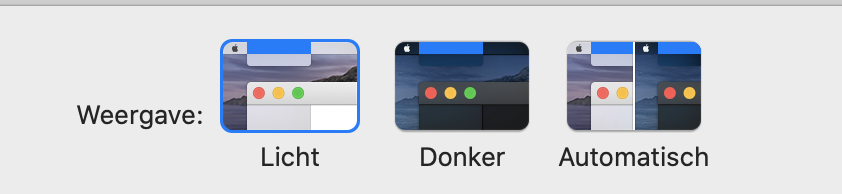
  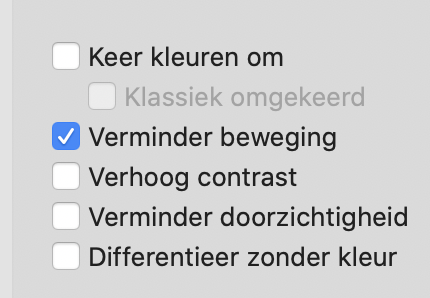

  ### Dit was lastig/Is niet gelukt:
  Wat ik in het begin lastig vond was het centeren van mijn logo na de animatie. De animatie begint met de Heineken ster die gecentered staat en vervolgens gepositioneerd wordt als before binnen de h1. Dit zorgde ervoor dat in theorie de h1 wel gecentered was maar omdat de before (ster) er nog voor kwam was het geheel niet gecentered. Dit heb ik opgelost met een animatie die na de ster rotation de positionering van het h1 element corrigeert. Dit heb ik getimed met een animation-delay zodat de overgang niet hakkerig is. 
  
Iets wat niet gelukt is dat na de animatie alsnog gescrolled kan worden in Chrome responsive mode, ondanks dat er overflow: hidden op de body zit. Ik las dat dit een bug kon zijn van Chrome responsive mode.

## Opdracht 2 plan

  ### Je ontwerp:
  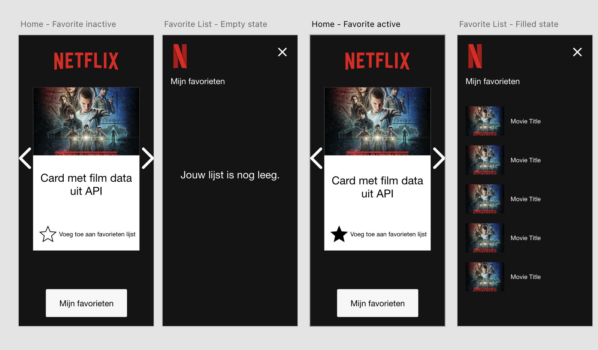

  ### Je ambitie: 
  Aan deze technieken/punten wil ik werken:
  - API
  - Data opslaan
  - Key events

## Opdracht 2 test

  
uitwerken na testen (week 7)

  ### Bevinding 1:
  Nog geen animaties.

  #### oplossing:
  De ster om een film in je favorieten te plaatsen animeren.

  ### Bevinding 2:
  Data wordt niet opgeslagen bij een refresh.

  #### oplossing:
  Data opslaan in local storage.

  ### Bevinding 3:
  Styling nog niet helemaal op orde.

  #### oplossing: 
  Styling afmaken.

## Opdracht 2 reflectie

  ### Je uitkomst - karakteristiek screenshot(s):
  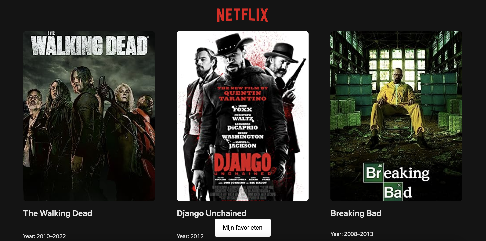
   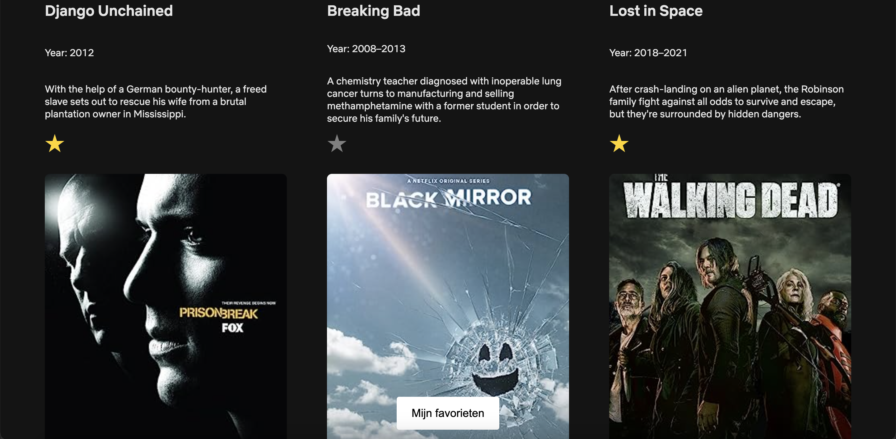
    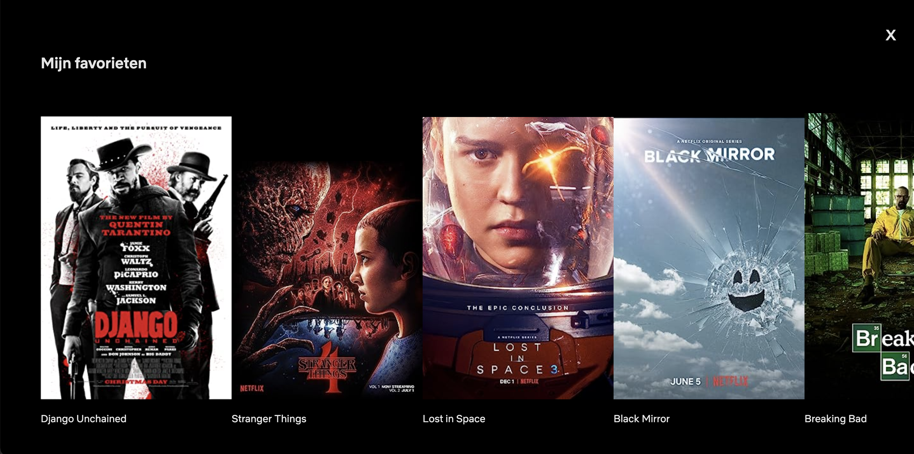

  ### Dit ging goed/Heb ik geleerd: 
  
  Ik had al eens eerder met een API gewerkt tijdens het vak Inleiding programmeren: https://build.drippin.it/weatherapp/. Tijdens dit 
  project heb ik echter alleen data opgehaald.
  
  Bij deze nieuwe opdracht voor FvD ben ik meer de diepte in gegaan door de focus te leggen op het opslaan van data naar een lijstje.

  

  ### Dit was lastig/Is niet gelukt:
  Waar ik lang tegen aan liep was het stylen van de buttons als er met de Tab key genavigeerd werd. Eerst probeerde ik het met de :focus   
  selector te realiseren. Dit werkte echter niet goed voor mijn use case omdat :focus ook getriggerd wordt on click en de styling was 
  alleen van toepassing bij het navigeren met de Tab key. Uiteindelijk ben ik gekomen bij het focus & blur event waarmee ik dit heb kunnen 
  oplossen.

  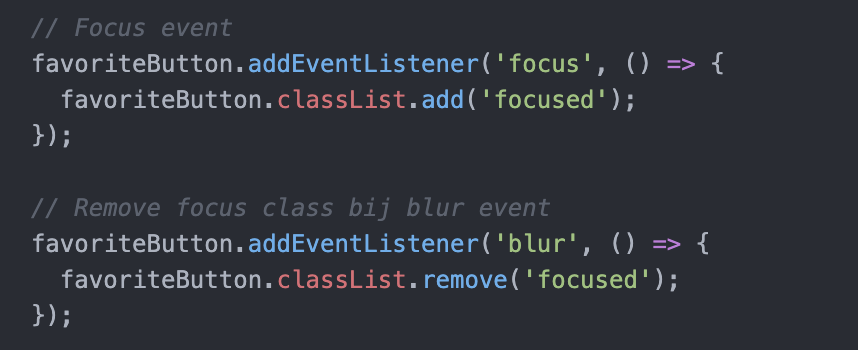

